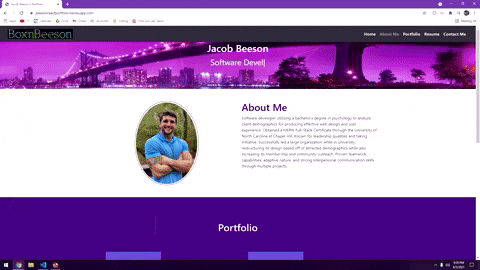

# React Portfolio 
  A personal portfolio designed using React.js and Bootstrap, along with othre useful Javascript dependencies.
   
  Livelink: https://jbeesonreactportfolio.herokuapp.com/
  
  

  ## <a name="toc">Table of Contents</a>
  * [Developer's Information](#devInfo)
  * [Credentials](#credentials)
  * [License](#license)

  ## <a name="devInfo">Developer's Information</a>[Table of Contents](#toc)
  Feel free to contact me using the information below if you have any questions or feedback!
   
  Name: Jacob(Jake) Beeson
   
  [Portfolio](https://boxnbeeson.github.io/Portfolio/)
   
  [Github](https://github.com/boxnbeeson)
   
  Email: boxnbeeson.jp@gmail.com

  ## <a name="credentials">Credentials</a>[Table of Contents](#toc)

  Followed 80/20 Coding's <i>React JS & Bootstrap 4</i> [Tutorial](https://www.youtube.com/watch?v=vD72tRK8mC4&t=1748s)
   
  [Bootstrap](https://getbootstrap.com/docs/5.0/getting-started/introduction/)

  ## <a name="license">License</a>[Table of Contents](#toc)
  MIT
